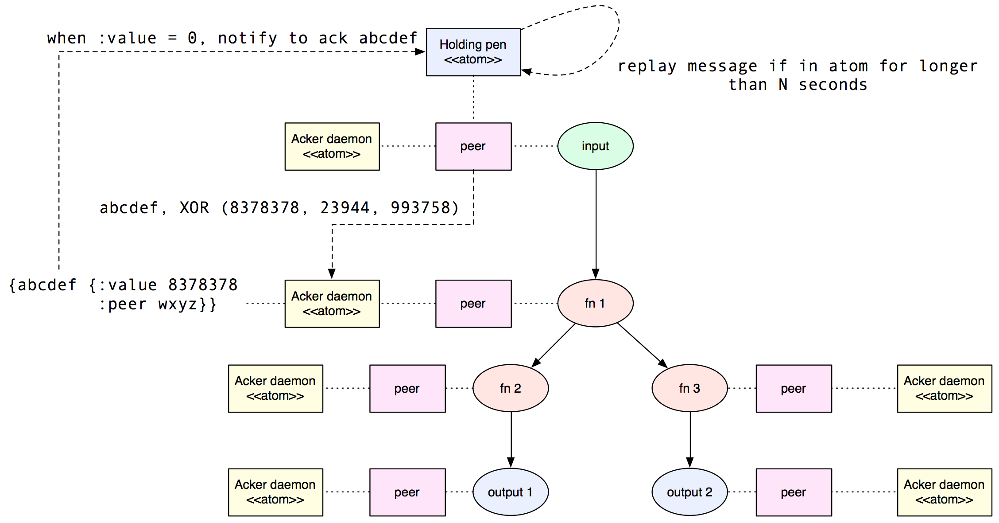

## Messaging

This design document outlines the new approach that Onyx will take in implementing messaging from 0.6.0 forward.
For a refresher of how Onyx messaging works as of 0.5.0, please refer to the Internal Design section of the User Guide.

### The pros of using a message broker

As of 0.5.0, Onyx uses the HornetQ message broker for communication. There are certainly some benefits to this approach:

- Provides a mechanism for built-in message acknowledgement
- Provides a mechanism for built-in message grouping
- Out of the box load balacing strategies for both the server and the client
- Built-in failover and replication, bugs are HornetQ's problem, not mine

### The cons of using a message broker

- While bugs in HornetQ may be JBoss's problem, they're also sort of mine, because they affect my product
- We write to disk way too much as a result of transactionally moving messages between tasks
- Need to scale the message brokers alongside peers - an operational burden on the developer
- Good fault tolerance requires replication, increasing latency by a constant factor per replica
- Setting up HornetQ is an operational concern by itself
- Configuring HornetQ is hard
- Transactional message movement doesn't matter nearly as much as I thought it might

### An alternate solution

One proposed solution is to copy-cat Apache Storm. Storm is very fast, and uses an in-memory algorithm
to implement fault tolerancy using ordinary HTTP. This boils down to the following large pieces:

- Each peer runs a lightweight HTTP server and client
- We move what it means to "acknowledge" and "replay" a segment to an interface that the input medium implements
- We use multiple, independent "acker server routes" across different peers to manage the success and fail of segments

- Add a lightweight HTTP server and client to each peer
- Implement back-off policies for peer's failing sending segments to each other
- Create an interface for what it means to "ack" and "replay" a segment for a specific input medium
- Define how to "ack" and "replay" segments for input mediums that don't provide it out of the box (e.g. SQL)
- Redefine replica logic to not volunteer peer's for task unless there is at least 1 peer per task
- Redefine peer logic to not start a peer lifecycle until it receives confirmation that at least one peer per task is ready
- Implement custom grouping logic to make sure messages are "sticky" for specific peers when grouping is enabled
- Define peer logic to *never* add new peers to a grouping task after a job has been started - this would throw off the hash-mod'ing algorithm
- Add an atom to any task lifecycle for an input as a "container-pen" for objects that need to be natively acked. (e.g. real HornetQ ack)
- Add an "acker" route on *every* peer web server to perform Onyx-specific message acknowledgment
- Add an atom to every peer's acking machinery as a "container-pen" for segments that need to be ack'ed via Onyx
- Implement XOR algorithm in peer's acking thread
- Add a timer-based job to every input task that releases segments in the "container-pen" that time out and need to be replayed
- Implement a load balancing algorithm for spreading out messages over a range of peer's for downstream tasks

How do peers look each other up?
Pluggable messaging?
Talk about how this is different from Storm
Greedy task scheduler needs to go
How do we ensure that *each* message is getting N seconds before a replay call?