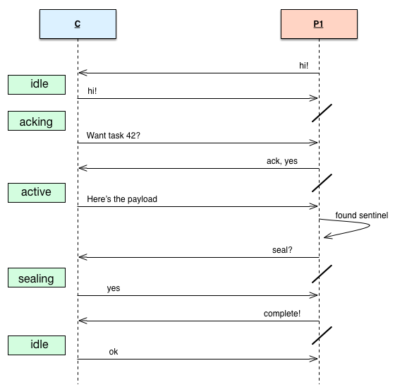
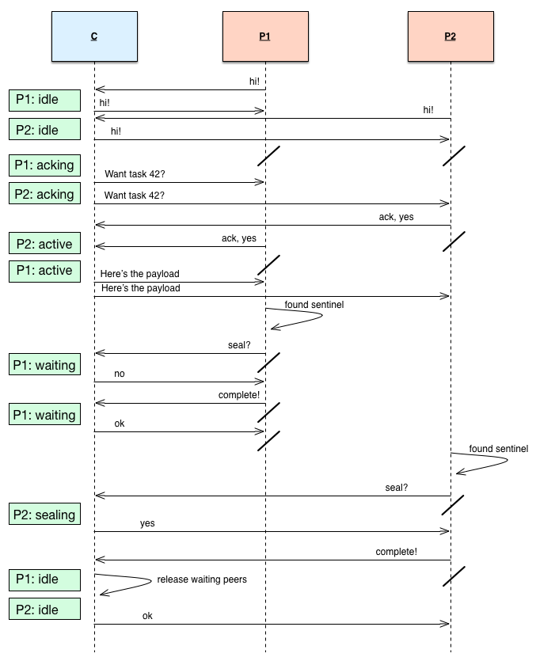
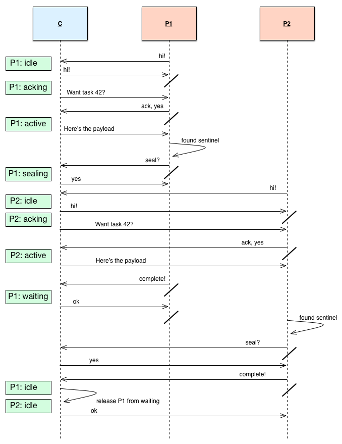
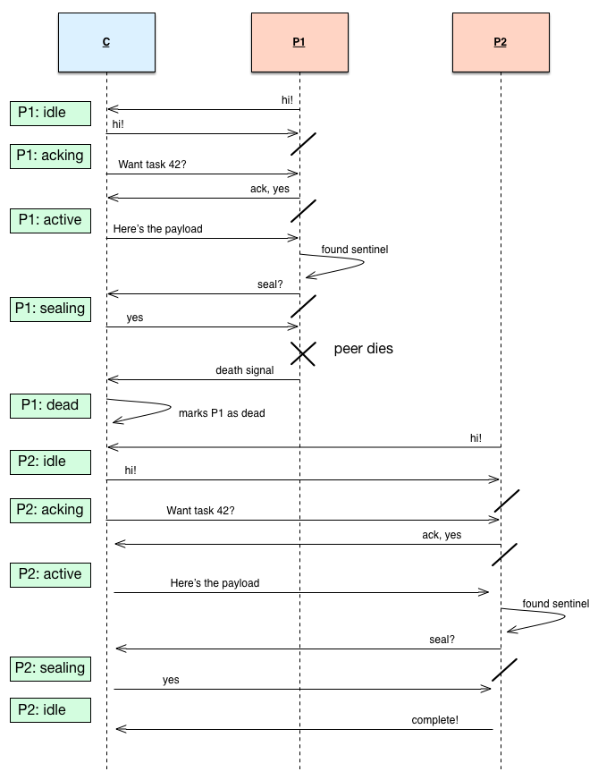
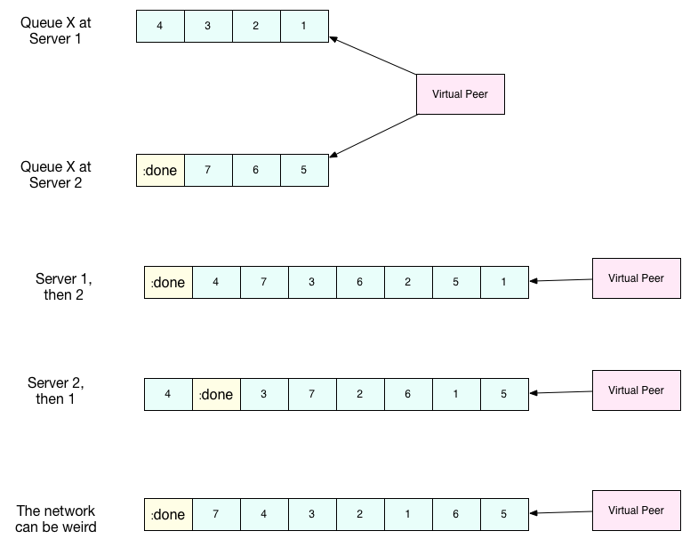
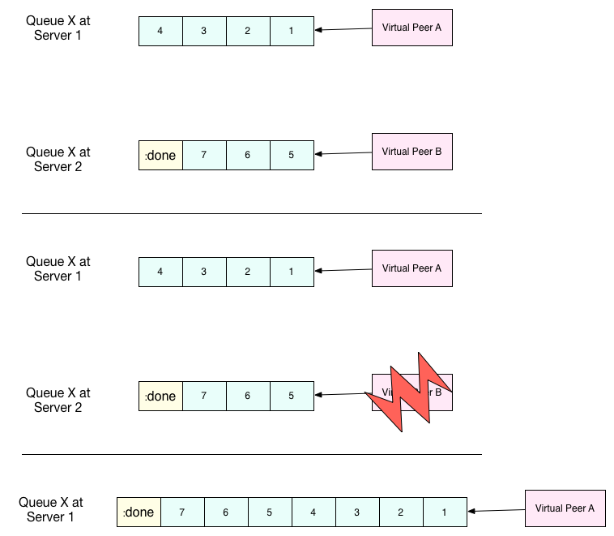

## Internal Design

This chapter outlines how Onyx works on the inside to meet the required properties of a distributed data processing system. This is not a formal proof nor an iron-clad specification for other implementations of Onyx. I will do my best to be transparent about how everything is working under the hood - good and bad. If something doesn't make sense, *keep moving*. There are inevitable forward references.

<!-- START doctoc generated TOC please keep comment here to allow auto update -->
<!-- DON'T EDIT THIS SECTION, INSTEAD RE-RUN doctoc TO UPDATE -->

- [High Level Components](#high-level-components)
  - [Coordinator](#coordinator)
  - [Peer](#peer)
  - [Virtual Peer](#virtual-peer)
  - [ZooKeeper](#zookeeper)
  - [HornetQ](#hornetq)
- [Cross Entity Communication](#cross-entity-communication)
- [Virtual Peer States](#virtual-peer-states)
  - [Description](#description)
  - [State Transitions](#state-transitions)
- [Coordinator Event Handling](#coordinator-event-handling)
  - [Serial Execution](#serial-execution)
  - [Fault Tolerant Logging](#fault-tolerant-logging)
  - [Timeouts](#timeouts)
- [Coordinator/Virtual Peer Interaction](#coordinatorvirtual-peer-interaction)
  - [Notation](#notation)
  - [1 Peer - happy path](#1-peer---happy-path)
  - [1 Peer - times out while acking](#1-peer---times-out-while-acking)
  - [1 Peer - dies while acking](#1-peer---dies-while-acking)
  - [1 Peer - dies while acking](#1-peer---dies-while-acking-1)
  - [1 Peer - dies while sealing](#1-peer---dies-while-sealing)
  - [1 Peer - dies while completing](#1-peer---dies-while-completing)
  - [2 Peers - 1 waits](#2-peers---1-waits)
  - [2 Peers - 1 joins while sealing](#2-peers---1-joins-while-sealing)
  - [2 Peers - 1 joins late and dies](#2-peers---1-joins-late-and-dies)
  - [2 Peers - 1 dies while sealing](#2-peers---1-dies-while-sealing)
- [Segment Transportation](#segment-transportation)
  - [HornetQ Single Server](#hornetq-single-server)
  - [HornetQ Cluster](#hornetq-cluster)
- [Virtual Peer Task Execution](#virtual-peer-task-execution)
  - [Phases of Execution](#phases-of-execution)
  - [Pipelining](#pipelining)
  - [Local State](#local-state)
- [Sentinel Values in a Distributed Setting](#sentinel-values-in-a-distributed-setting)
  - [Sentinel-in-the-Middle](#sentinel-in-the-middle)
  - [Sentinel Reduction](#sentinel-reduction)

<!-- END doctoc generated TOC please keep comment here to allow auto update -->

### High Level Components

#### Coordinator

The Coordinator is single node in the cluster responsible for doing distributed coordination. It receives jobs from Onyx clients, assigns work to peers, and handles peer failure.

#### Peer

A Peer is a node in the cluster responsible for processing data. It is similar to Storm's Worker node. A peer generally refers to a physical machine, though in the documentation, "peer" and "virtual peer" are often used interchangeably.

#### Virtual Peer

A Virtual Peer refers to a single peer process running on a single physical machine. Each virtual peer spawns about 15 threads to support itself since it is a pipelined process. The Coordinator sees all virtual peers as equal, whether they are on the same physical peer or not. Virtual peers *never* communicate with each other - they only communicate with the Coordinator.

#### ZooKeeper

Apache ZooKeeper is used as storage and communication layer. ZooKeeper takes care of things like CAS, consensus, leader election, and sequential file creation. ZooKeeper watches are at the heart of how Onyx virtual peers communicate with the Coordinator.

#### HornetQ

HornetQ is employed for shuttling segments between virtual peers for processing. HornetQ is a queueing platform from the JBoss stack. HornetQ queues can cluster for scalability.

### Cross Entity Communication

ZooKeeper is used to facilitate communication between the Coordinator and each virtual peer. Onyx expects to use the `/onyx` path in ZooKeeper without interference. The structure of this directory looks like the following tree (descriptions in-line):

- `/onyx`
  - `/<deployment UUID>` # `:onyx/id` in Coordinator and Peer
    - `/peer`
      - `/<UUID>` # composite node, pointers to other znodes
    - `/status`
      - `/<UUID>` # presence signifies that peer should continue to commit to HornetQ
    - `/task`
      - `/<UUID>`
        - `/task-<sequential-id>` # composite node, pointers to znodes about this task
        - `/task-<sequential-id>.complete` # marker node, signifies that task is complete
    - `/ack`
      - `/<UUID>` # peer touches this znode to acknowledge task acceptance
    - `/catalog`
      - `/<UUID>` # data node for the catalog
    - `/job-log`
      - `/offer-<sequential id>` # durable log of job IDs to do round-robin job dispersal
    - `/job`
      - `/<UUID>` # composite node, pointers to other znodes about this job
    - `/payload`
      - `/<UUID>` # composite node, pointers to other znodes about this payload for a task
    - `/pulse`
      - `/<UUID>` # ephemeral node for a peer to signify that it is still online
    - `/completion`
      - `/<UUID>` # peer touches this znode to signal that its finished with its task
    - `/cooldown`
      - `/<UUID>` # peer listens on this node for response from Coordinator about completion
    - `/workflow`
      - `/<UUID>` # data node for the workflow
    - `/election`
      - `/proposal-<sequential id>` # leader election nodes for stand-by Coordinators
    - `/plan`
      - `/<UUID>` # Durable log of jobs to submit to the Coordinator
    - `/seal`
      - `/<UUID>` # Peer touches this node to signal that it can seal the next queue
    - `/exhaust`
      - `/<UUID>` # Peer listens to this node for response from Coordinator about sealing
    - `/coordinator` # Durable log entries of all the prior actions for fault tolerance
      - `/revoke-log`
        - `/log-entry-<sequential id>`
      - `/born-log`
        - `/log-entry-<sequential id>`
      - `/seal-log`
        - `/log-entry-<sequential id>`
      - `/ack-log`
        - `/log-entry-<sequential id>`
      - `/death-log`
        - `/log-entry-<sequential id>`
      - `/evict-log`
        - `/log-entry-<sequential id>`
      - `/offer-log`
        - `/log-entry-<sequential id>`
      - `/shutdown-log`
        - `/log-entry-<sequential id>`
      - `/exhaust-log`
        - `/log-entry-<sequential id>`
      - `/planning-log`
        - `/log-entry-<sequential id>`
      - `/complete-log`
        - `/log-entry-<sequential id>`
    - `/peer-state`
      - `/<UUID>`
        - `/state-<sequential id>` # Data node for state of the peer
    - `/shutdown`
      - `/<UUID>` # Peer listens to this node, shuts down on trigger

### Virtual Peer States

#### Description

Each virtual peer can be in exactly one state at any given time. The Coordinator tracks the state of each virtual peer. In fact, the virtual peer does not know its only state. The state for each peer is maintained so that the Coordinator can make intelligent decisions about how to allocate work across the cluster.

The peer states are:

- `:idle` - Peer is not allocated to a task
- `:acking` - Peer is deciding whether it wants to accept a task given to it by the Coordinator
- `:active` - Peer is executing a task
- `:waiting` - Peer has finished executing a task, but other peers are still finishing the same task. Cannot yet be reallocated to `:idle`, otherwise peer would continuously be allocated and removed from the same task.
- `:sealing` - Peer is propagating the sentinel onto the task's egress queues.
- `:revoked` - Peer has had its task taken away from it. Peer will shortly be killed off by the Coordinator.
- `:dead` - Peer has crashed, and may not receive any more tasks.

#### State Transitions

Peer states transition to new states. The transitions are specified below.

- An `:idle` peer may transition to:
  - `:acking`: Peer is given a task by the Coordinator
  - `:dead`: Peer crashes
  - `:idle`: Stand-by Coordinator wakes up and replays log entries

- An `:acking` peer may transition to:
  - `:active`: Peer acknowledges a task from the Coordinator
  - `:revoked`: Peer fails to acknowledge a task before the Coordinator times out
  - `:dead`: Peer crashes
  - `:acking`: Stand-by Coordinator wakes up and replays log entries

- An `:active` peer may transition to:
  - `:sealing`: Peer reads the sentinel from an ingress queue, and the ingress queue is depleted
  - `:waiting`: Peer reades the sentinel value from an ingress queue, and the ingress queue is depleted, but other peers are `:acking` or `:active`.
  - `:dead`: Peer crashes
  - `:active`: Stand-by Coordinator wakes up and replays log entries

- A `:waiting` peer may transition to:
  - `:idle`: Other peers completing the same task finish or crash
  - `:dead`: Peer crashes
  - `:waiting`: Stand-by Coordinator wakes up and replays log entries

- A `:sealing` peer may transition to:
  - `:idle`: Peer tells Coordinate that the task is complete, and no other peers are `:acking` or `:active` on the same task
  - `:dead`: Peer crashes
  - `:sealing`: Stand-by Coordinator wakes up and replays log entries

- A `:revoked` peer may transition to:
  - `:dead`: Peer crashes or Coordinator manually kills off peer
  - `:revoked`: Stand-by Coordinator wakes up and replays log entries

- A `:dead` peer may transition to:
  - `:dead`: Stand-by Coordinator wakes up and replays log entries

### Coordinator Event Handling

The Coordinators holds watches on znodes in ZooKeeper and reacts to events. The events are placed onto core.async channels and serialized.

#### Serial Execution

All events coming out of ZooKeeper are serialized onto a single core.async channel. This techniques allows ZooKeeper to act "transactional" for the particular workload that Onyx places on it. It's designed this way so that multiple writers can read incomplete or inconsistent values from ZooKeeper just before commiting to storage.

#### Fault Tolerant Logging

Just before each event's action is executed, the event is written to a durable log in ZooKeeper. When the Coordinator boots up, it runs through the log from the last known checkpoint and replays entries. All actions in the Coordinator are idempontent, so they are can be safely replayed if they crashed mid-action.

#### Timeouts

As of present, the Coordinator only has one situation where it employs timeouts. When a Coordinator offers a task to a peer, the peer must acknowledge that it wants to execute that task. If the peer doesn't make a decision about whether or not it wants the task within the timeout interval, the Coordinator revokes the task from the peer and marks the peer as dead. The peer can no longer receive new tasks.

### Coordinator/Virtual Peer Interaction

This section captures the interactions between the Coordinator and a peer under a variety of interesting circumstances. In particular, I try to show how Onyx is able to recover in the face of crashed peers at very specific points in time by indicating what the states of the peer are on the left of each diagram.

#### Notation

- "/": Right-way black-slash indicates blocking. No forward progress happens until the next message is received.
- "C": Coordinator
- "P", "P1", "P2": Peers
- "Green box": Peer state as known by the Coordinator

Time flows from top to bottom.

#### 1 Peer - happy path

#### 1 Peer - times out while acking

#### 1 Peer - dies while acking

#### 1 Peer - dies while acking

#### 1 Peer - dies while sealing

#### 1 Peer - dies while completing

#### 2 Peers - 1 waits

#### 2 Peers - 1 joins while sealing

#### 2 Peers - 1 joins late and dies

#### 2 Peers - 1 dies while sealing

### Segment Transportation

Onyx uses HornetQ to move segments between virtual peers. HornetQ queue's are constructed between every link in a workflow.

For example, `{:in {:inc :out}}` is transformed into the following queueing topology:

`<queue> <- in -> <queue> <- inc -> <queue> <- out -> <queue>`

All tasks have exactly one ingress queue, and at least one egress queue. Each egress queue is an ingress queue to the next task, if there is a next task.

#### HornetQ Single Server

Using a single HornetQ server, we are garunteed ordering of messages. Peers connect to the HornetQ server and consume messages.

#### HornetQ Cluster

In order to scale, we need a *cluster* of queues between each link the workflow. Using one queue would limit the network bandwidth to move data. HornetQ itself implements clustering, and some useful facts to know are:

- Each server in the cluster holds *its own* queue that participates in the cluster.
- Servers use *symetric* clustering. Every HornetQ server knows about every other HornetQ server.
- Producing messages onto a clustered queue will load balance them round-robin across all queues in the cluster.
- Consuming messages from a clustered queue will read them round-robin from all queues in the cluster.
- Producing and consuming messages happens in the context of a transaction.
- Transactions happen in the context of a HornetQ *session*.
- A session may be only manipulated by one thread at a time.

#### Client Side Load Balancing

During client side load balancing, messages can be read in a variety of ways. Below, we see a peer reading off of two HornetQ servers. Messages can be read starting at either server, causing at least two different streams of messages to be read. Round robin isn't a promise, though. The network may hiccup, and we might see messages in a completely jumbled up stream. Note, though, that individual queue messages are consistently ordered.

#### Message Dispersal Under Failure

As long as a HornetQ consumer is connected to a queue on a HornetQ server, it will be included in the round-robin message load balancing. If, however, the consumer disconnects and there are no other consumers, that queues messages are sent to another queue in the cluster. This prevents consumers on other queues being starved if they cannot access the messages on a machine with no open consumers. The messages are stacked on the back of other queues, again in a load balanced fashion:

### Virtual Peer Task Execution

One virtual peer may be executing at most executing one task. This section describes what activies the peer carries out during execution.

#### Phases of Execution

- Inject resources: Creates HornetQ session and opens transaction
- Read message batch: consumers messages off of HornetQ
- Decompress message batch: Uses Fressian's reader to obtain EDN maps of segments
- Strip sentinel: removes sentinel from decompressed batch if present
- Requeue sentine: Requeues the sentinel on the ingress queue if it is the leader
- Apply function: Apply fns to batches of segments
- Compress message batch: Uses Fressian's writer to compress segments to bytes
- Write message batch: Writes messages to HornetQ
- Status check: Consults with ZooKeeper about this peer's liveness
- Ack message batch: Acknowledges received messages from HornetQ
- Commit transaction: Commits the transaction to HornetQ
- Close resources: Closes open connections and sockets
- Reset payload: Rotates the znode this virtual peer is listening on for new tasks
- Seal egress queue: If this virtual peer is allowed, propagates the sentinel to the egress queues
- Update local listeners: Rotates listeners for ZooKeeper for the next task

#### Pipelining

The Peer process is extensively pipelined for performance reasons. As it turns out, Onyx's peer faces the same situation as Datomic's transactor. You can listen to Rich talk about it [here](http://www.infoq.com/presentations/Datomic) (36:05).

To talk about why this helps, we need an understanding of what properties Onyx requires to be correct and how HornetQ works. Onyx offers both concurrent and sequential processing. In the case of sequential processing, it's critical that we never jumble up the order that the messages are streamed in.

When we produce and consume messages using HornetQ, we do so in the context of a "session". Onyx strictly uses transactional HornetQ sessions. That means we can move messages between queues *atomically*. That's how Onyx is able to offer it's transactional semantics. HornetQ sessions, as it ends up, are hostile to being accessed by multiple threads. In fact, HornetQ sessions have built in detection for being accessed concurrently. An exception will be thrown indicating that this is happening.

So in order to go fast and preserve message order for sequential processing, we *pipeline* the virtual peer. The trick with HornetQ is to understand that it's not the case that a session only ever needs to run on one thread - but that only a single thread can be using the session at an instance in time. In the case of using a session strictly serially as you suggested, we would: open the session, start the transaction, read messages off the queue, decompress messages, apply functions to messages, compress messages, and write messages back to the queue. There are more steps, but the point is that each of these steps can run on their *own* thread. The first step of the pipeline is to create a HornetQ session. Since each stage of the pipeline can only operate on one thing at a time, we're guaranteed that each HornetQ session is isolated to one thread at a time. At the same time, the process is still basically serial. Messages are processed in order. This is how Onyx efficiently utilizes all the cores of the box. If the box has 4 cores with 4 hyper-threads, 16 concurrent activities can run without much CPU contention.

There is one other thing I'd like to point out. Pipelining definitely is trickier to do correctly. We have to worry about things like flushing values and closing sessions sequentially down the pipeline for a clean shutdown. That being said, there are a whole bag of neat testing tricks you can play when isolate each activity to its own thread. The activities are now *temporally* decoupled - they all run on their own timelines. Connecting these with core.async channels that are multiplexed means that you can add additional listeners, or *spies*, if you will, in your test code. You can monitor the values that are being passed through the pipeline. You can work with each activity independently since they are fully decoupled.

#### Local State

Each virtual peer has one atom that it uses for local state. It is a map that has a key for whether it has ever asked the Coordinator to seal, and a key for what the sentinel leader is. The latter is used as a local cache, whereas the former is used to avoid deadlock. Virtual peers can ask to seal exactly once. The Coordinator will ignore subsequent requests to seal. Since this process is pipelined, we need a way to convey this information *backwards* through the pipeline. The shared atom accomplishes this.

### Sentinel Values in a Distributed Setting

One of the challenges in working with distributed systems is the property that messages can be delayed, duplicated, dropped, and reordered. For the most part, HornetQ's transactions aid with a lot of these concerns. One particularly difficult point, though, is the notion of "sealing". In order to propagate the sentinel value from one queue to the next, all of the segments must be processed. This is the key attribute that allows for at-least-once processing semantics. Unfortunately, inbetween the time that each peer asks the coordinator if it can seal, and by time it actually does seal and reports back, the peer can be fail. Worse yet, we have no way of knowing whether it successfully wrote the sentinel to the next queue. Therefore, we need to make this operation idemponent and handle multiple sentinel values. We also need to be able to handle sentinel values that appear in the middle of the queue due to the way HornetQ load balances.

#### Sentinel-in-the-Middle

As shown above, the sentinel value can easily sneak into the middle of a queue. Obviously, a sentinel found in the middle of the queue doesn't actually mark the end of a workload. Onyx combats this by querying the queue cluster for the total number of messages across all queues in this cluster. If this number is not *1* (just the sentinel that we're holding at present), there are presumably more segments behind it that need to be processed.

We could requeue this sentinel and place it at the back of the queue. If we did this, though, we would spin into an infinite loop in the presence of multiple sentinel values. Instead, we *reduce* the number of sentinel values. We pick one sentinel value as the "leader", and drop all other sentinels. The leader is always requeued at the back. Eventually, we find the end and propagate the sentinel value to the egress queues.

#### Leader Election

Each sentinel value is marked with metadata when it is put on HornetQ. Specifically, each sentinel carries a UUID to uniquely identify it. When a peer encounters a sentinel for the first time in its lifecycle of a task, it tries to write the UUID of the sentinel to ZooKeeper. The semantics of ZooKeeper are such that multiple writers can try to write to the same znode, but only one will suceed. This guaruntees that exactly one leader will be picked. After the peer writes, or votes, for the UUID, it immediately reads from ZooKeeper to see what the leaders UUID is. It caches the leader's UUID locally, since it will not change. If the sentinel it is holding matches the leader's UUID, it requeues the sentinel so that others may find it. If it does not match, the sentinel is discarded. Hence, the number of sentinels on an ingress queue converges towards 1.

